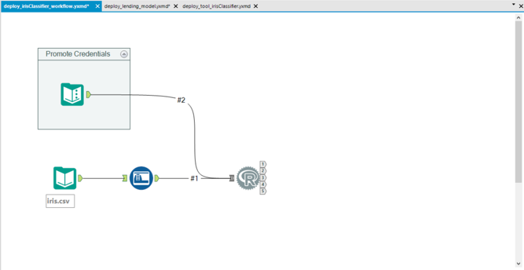
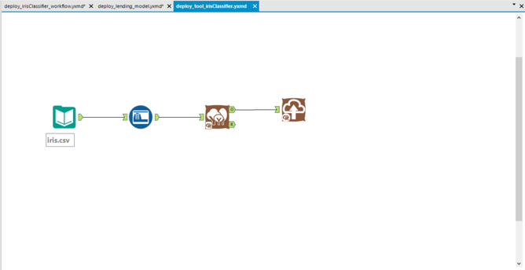

### Iris Classifier

This model uses a RandomForest algorithm to classify different flower species:

Iris Setosa, Iris Versicolor, Iris Verginica

`train.R` demonstrates how to deploy this model directly from within an R console.
`deploy_irisClassifier.yxmd` demonstrates how to build the same model using Alteryx Designers' R tool
`deploy_tool_irisClassifier.yxmd` demonstrates how to build the same model using Alteryx Designers' RandomForest tool

